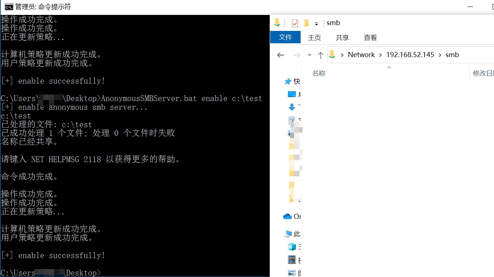
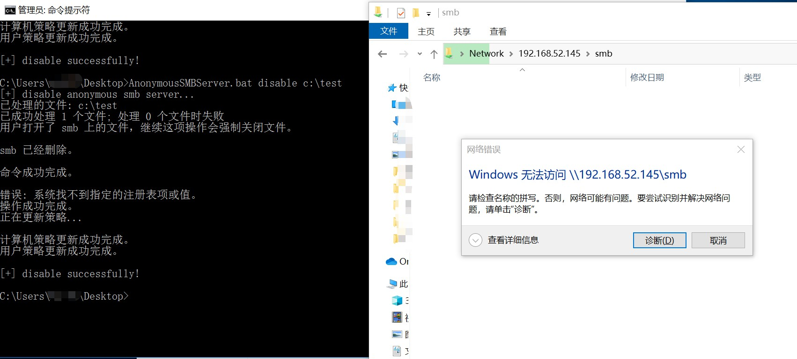

# Anonymous SMB Server Manager

## 介绍

一个红队 BAT 小脚本，可以快速对指定文件夹开启和关闭匿名SMB共享，适合搭配 PrintNightmare 漏洞使用。

## 使用方法

### 基本命令

```
AnonymousSMBServer.bat <enable|disable> <dir>
```

### 开启匿名SMB：

```
AnonymousSMBServer.bat enable c:\test
```



### 关闭匿名SMB：

```
AnonymousSMBServer.bat disable c:\test
```


